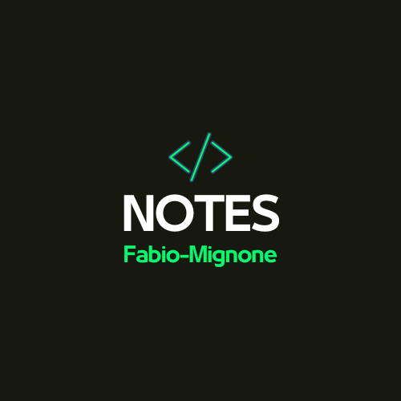
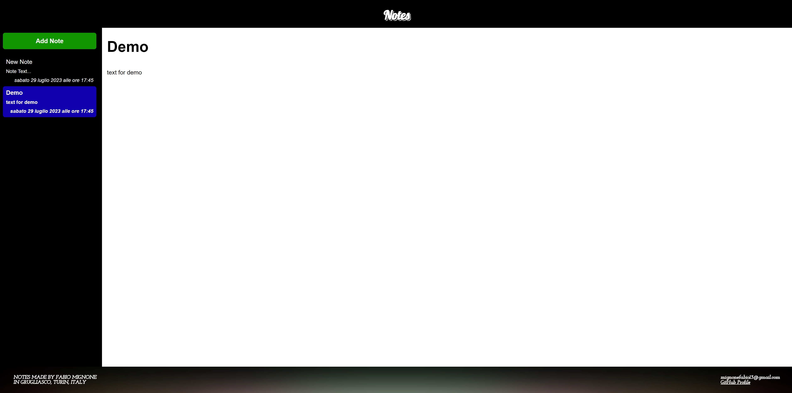

 

  

  <h3 align="center">NOTES</h3>

  

    Your Local Note-Taking Companion!
     
     
    <a href="https://github.com/Fabio-Mignone/NOTES"><strong>Explore the docs »</strong></a>
     
     
    <a href="https://github.com/Fabio-Mignone/NOTES">View Demo</a>
    .
    <a href="https://github.com/Fabio-Mignone/NOTES/issues">Report Bug</a>
    .
    <a href="https://github.com/Fabio-Mignone/NOTES/issues">Request Feature</a>
  

    

## Table Of Contents

* [About the Project](#about-the-project)
* [Built With](#built-with)
* [Getting Started](#getting-started)
  * [Prerequisites](#prerequisites)
  * [Installation](#installation)
* [Usage](#usage)
* [Roadmap](#roadmap)
* [Contributing](#contributing)
* [License](#license)
* [Authors](#authors)

## About The Project

Introduction:
Welcome to NOTES: Your Local Note-Taking Companion! Organize and maintain your notes effortlessly with our local storage-based website. No accounts needed; it's just you and your notes on one machine. Simple, secure, and clutter-free. Start noting with NOTES today!

How to use it:
The application works with a button that allows the creation of the note, then on the right you can edit the text and the title, to delete a note just double click on the title of the note in the list on the left.

## Built With

This game is built using Javascript for the logic and html with the addition of Css for the front-end interface.

## Getting Started

The easiest way to run this app on your PC is by downloading the zip folder, unzip the repository with any tool and run the .html file(keep in mind the html file should be on the same folder of the other file to work).

### Prerequisites

To run the app you just need a browser(the css style maybe can be different due to browser interpretation).

### Installation

No installation required, unzip the file and run it(feel free to use it on your website, just respect the License)

## Usage

This app works perfectly on any browser, easy to implent on any other website

## Roadmap

See the [open issues](https://github.com/Fabio-Mignone/NOTES/issues) for a list of proposed features (and known issues).

## Contributing

Contributions are what make the open source community such an amazing place to be learn, inspire, and create. Any contributions you make are **greatly appreciated**.
* If you have suggestions for adding or removing projects, feel free to [open an issue](https://github.com/Fabio-Mignone/NOTES/issues/new) to discuss it, or directly create a pull request after you edit the *README.md* file with necessary changes.
* Please make sure you check your spelling and grammar.
* Create individual PR for each suggestion.
* Please also read through the [Code Of Conduct](https://github.com/Fabio-Mignone/NOTES/blob/main/SECURITY.md) before posting your first idea as well.

### Creating A Pull Request

1. Fork the Project
2. Create your Feature Branch (`git checkout -b feature/AmazingFeature`)
3. Commit your Changes (`git commit -m 'Add some AmazingFeature'`)
4. Push to the Branch (`git push origin feature/AmazingFeature`)
5. Open a Pull Request

## License

Distributed under the GPL-3.0 License. See [LICENSE](https://github.com/Fabio-Mignone/NOTES/blob/main/LICENSE) for more information.

## Authors

* **Mignone Fabio** - *Passionate Developer* - [Mignone Fabio](https://github.com/Fabio-Mignone)
